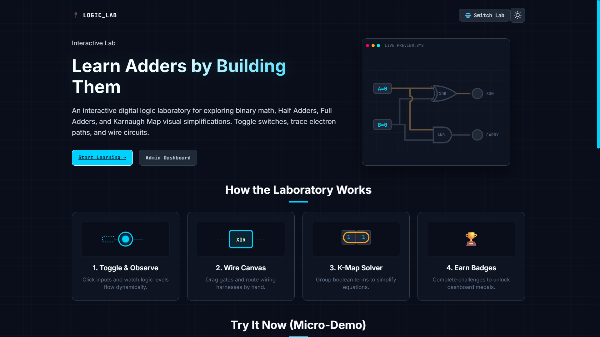
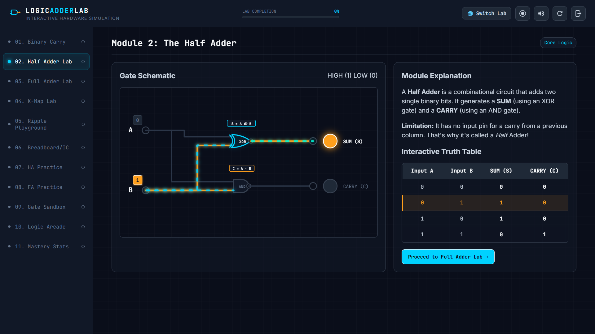
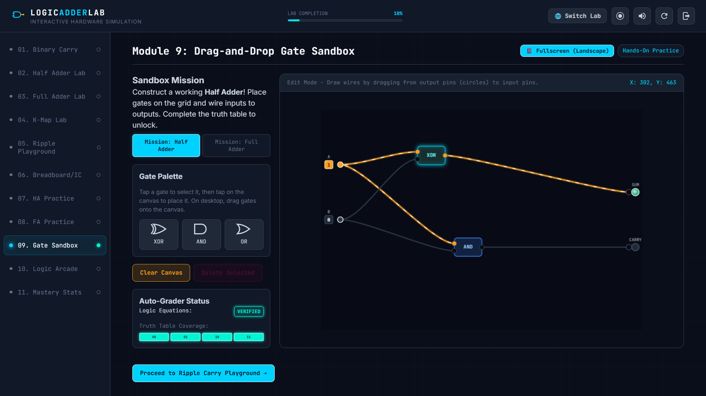
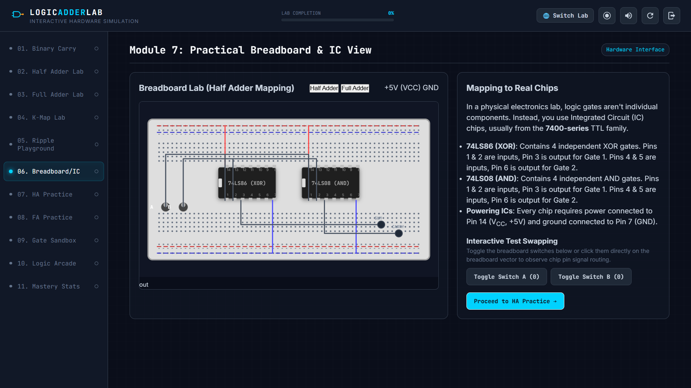

# 🔌 LogicLab — Interactive Logic Adder Lab

**An interactive hardware simulation lab for learning binary addition, logic gates, and propagation delays — right in your browser.**


Logic Adder Lab turns the classic "half adder / full adder" digital-logic topic into a full, hands-on virtual lab — complete with gate schematics, a K-Map playground, a 4-bit ripple-carry simulator, a breadboard/IC view, drag-and-drop gate building, timed practice exams, and a mastery/badge dashboard. It's a single self-contained web app with **no backend required** and works fully offline as an installable Progressive Web App (PWA).

---

## 📸 Screenshots

<table>
  <tr>
    <td width="50%">
      
      <p align="center"><em>Landing page with a live gate preview and a 4-step "How the Laboratory Works" guide</em></p>
    </td>
    <td width="50%">
      
      <p align="center"><em>Half Adder module — live gate schematic + interactive truth table</em></p>
    </td>
  </tr>
  <tr>
    <td width="50%">
      
      <p align="center"><em>Drag-and-drop Gate Sandbox with a live auto-grader</em></p>
    </td>
    <td width="50%">
      
      <p align="center"><em>Breadboard/IC view mapping circuits to real 74-series chips</em></p>
    </td>
  </tr>
</table>

---

## ✨ Features

| Module | What it does |
|---|---|
| 💡 **01. Why We Need Carries** | Interactive decimal-vs-binary demo showing how bit overflow forces a carry |
| ➕ **02. The Half Adder** | Live gate schematic (XOR + AND) with toggleable inputs and real-time SUM/CARRY output |
| 🔀 **03. The Full Adder** | Gate-level *and* block-level (2×HA + OR) circuit views |
| 🧮 **04. Karnaugh Map (K-Map) Lab** | Visual K-Map minimizer for both Half Adder and Full Adder outputs |
| 🔁 **05/06. 4-Bit Ripple-Carry Playground** | Chain full adders together and watch the carry bit *propagate* left with simulated gate delay |
| 📟 **07. Breadboard & IC View** | Practical breadboard/DIP IC pinout mapping for Half and Full Adder circuits |
| 📝 **Truth Table Practice** | Fill-in-the-blank SUM/CARRY practice tables for both Half and Full Adders |
| 🧩 **09. Drag-and-Drop Gate Sandbox** | Build circuits from scratch by placing and wiring gates to complete a mission (fullscreen/landscape mode included) |
| 🛡️ **10. Formal Assessment Protocol** | Timed, proctored-style exam mode with a live timer, security-violation tracking, and live scoring |
| 🎓 **Mastery Dashboard** | Unlockable badges and progress tracking across every module |
| 🔊 **Synth Audio Feedback** | Click, hum, and pulse sound effects synthesized live with the Web Audio API (togglable) |
| 🌗 **Light/Dark Theme** | Theme preference saved locally and restored on load |
| 🎨 **UI Customizer & Presets** | Rebrand the app title/tagline/logo, pick an accent palette, toggle visible modules, and switch between ready-made layout presets (Full Lab, Sandbox Focus, Exam Mode, Breadboard Workshop) |
| 📤 **Share & Export** | Generate a shareable link or export/import your UI configuration as a `.json` template |
| 🌐 **Universal Lab Navigator** | Jump between this lab and sibling ECE virtual labs (gates, subtractor, parallel adder/subtractor, code converters, encoders/decoders, MUX/DEMUX, and more) |

---

## 📱 Progressive Web App

Logic Adder Lab is fully installable and works offline:

- **Installable** on desktop and mobile via the browser's "Add to Home Screen" / install prompt
- **Offline-first** — a service worker (`sw.js`) caches the app shell and Google Fonts so the lab keeps working without a connection
- **Standalone display** with a custom theme color and emoji app icon (🔌)

---

## 🛠️ Tech Stack

- **HTML5** — semantic structure, SVG-based circuit diagrams, Open Graph meta tags
- **CSS3** — custom properties (CSS variables) for theming, responsive grid layouts
- **Vanilla JavaScript** — no frameworks; drag-and-drop interactions, live circuit simulation logic, and the exam engine
- **Web Audio API** — procedurally synthesized UI sound effects
- **Service Worker + Web App Manifest** — offline caching and installability
- **`localStorage`** — persists theme choice, arcade high scores, and student progress locally

---

## 🚀 Getting Started

No build step, no dependencies, no server required.

### Option 1: Open directly
Simply open `index.html` in any modern browser.

### Option 2: Run a local server (recommended, for full PWA/service-worker support)

```bash
# Using Python
python3 -m http.server 8000

# Or using Node.js
npx serve .
```

Then visit `http://localhost:8000` in your browser.

---

## 📂 Project Structure

```
LogicLab/
├── index.html            # App shell, layout, and all 10+ lab modules
├── style.css             # Theming, layout, and component styles
├── script.js             # Circuit simulation logic, interactions, exam engine, audio
├── manifest.json         # PWA manifest (icons, theme color, display mode)
├── sw.js                 # Service worker for offline caching
└── screenshots/          # Preview images used in this README
```

---

## 🎯 Learning Outcomes

This lab is built for students studying **Digital Electronics / Computer Organization**, and covers:

- Binary addition and carry propagation
- Half Adder and Full Adder design (truth tables, Boolean expressions, gate circuits)
- Karnaugh Map simplification
- Ripple-carry adder chaining and propagation delay
- Practical IC/breadboard realization of adder circuits
- Self-assessment through practice tables and timed exams

---

## 🤝 Contributing

Suggestions and improvements are welcome — feel free to open an issue or submit a pull request.

---

<div align="center">

**Built for hands-on digital logic learning 🔌**

</div>
